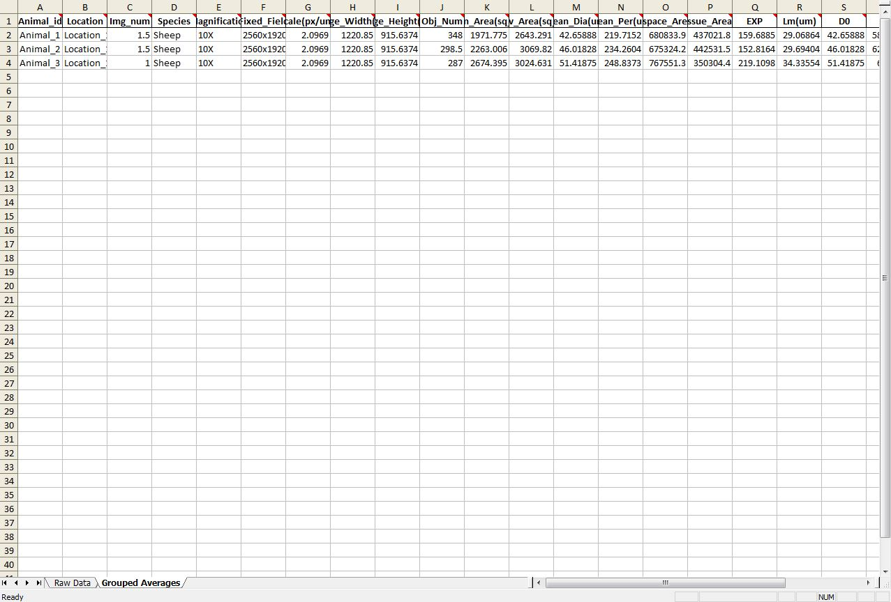

# Autolung

(c) 2019 Gennaro Calendo, Marla R. Wolfson, MS, PhD, Laboratory of Marla R. Wolfson, MS, PhD at the Lewis Katz School of Medicine Temple University, Philadelphia, PA.

The image processing steps used in this program were derived from [Muñoz-Barrutia, et al., (2012)](https://www.ncbi.nlm.nih.gov/pubmed/23197972), [Jacob et al., (2009)](https://www.ncbi.nlm.nih.gov/pubmed/19688093), [Parameswaran et al., (2006)](https://www.ncbi.nlm.nih.gov/pubmed/16166240), and [Salon et al., (2015)](https://www.ncbi.nlm.nih.gov/pubmed/25695836).

## Installation/Running the app

In the future, I would like to make this a standalone application using PyQt and pyinstaller. For now, these are the steps to get running.

1. Clone the repo. `git clone https://github.com/jcalendo/autolung.git`
2. Change into the directory. `cd autolung\`
3. Create Conda Environment. `conda env create -f environment.yml`
4. Activate autolung_env. `source activate autolung`
5. Run the app script. `python autolung\app.py`

The main window should appear.


## Overview of the Main Options

- **Select folder containing lung images**: Browse to the folder where your images are saved. *NOTE:* All images should be in .tif format. Other images formats will not work without changing code in the `load_images` module.
- **Select the configuration file for this image set**: Select the path to where the config file is saved. Config files control the settings that the program uses to perform thresholding, morphology, and measurements. See *Configurations Files* below for details.
- **Select the folder where the results will be saved**: The program generates an Excel file of the measurement results. Select the path where you want the results saved to.
- **Would you like to save QC images**: Select "Yes" or "No". "Yes" will save a four-panel image of the grayscale, thresholded, filled, and connected components images for every image to be processed. QC images are saved in a 'QC' folder within the lung images directory.

## Configuration Files

All of the analysis steps are dependent on the configuration file being set up properly. The configuration files are simple text files that are easy to edit and understand, hopefully making this program extensible to other image sets. The config files only have three sections and only *really* 5 values that must be set correctly. Config files look like this:

```
[Image_Metadata]
Species: Sheep
Magnification: 10X
Fixed_Field: 2560x1920
Scale: 2.0969

[Threshold_Params]
Block_Size: 251
Constant: 0

[Morphology_Params]
Min_Alveolar_Size: 500
Max_Speckle_Size: 100
```

- `Species`, `Magnification`, and `Fixed_Field` will all be used as grouping variables and do not affect the image processing. Here, `Magnification` represents the objective used and `Fixed_Field` is the size of the image in pixels.
- `Scale` is a very important variable. `Scale` **must be set in px/um** for the final measurements to be calibrated properly.
- `Block_Size` and `Constant` are used in the thresholding steps of the image processing. Their values are pixels. If you are working with new images and are finding that there is a lot of 'speckling' in your airspaces, try increasing the `Block_Size` first.
- `Min_Alveolar_Size` is the size, in pixels, of an airspace. Any value under this number will be excluded from the measurements. `Max_Speckle_Size` is the size of abberations or speckles, in pixels, present in airspaces that should be removed. Speckling smaller than this value will be removed from airspaces.

## Output File

The resulting Excel file will be saved to the output location with the name `Lung_Data_yyyymmdd-hhmmss.xlsx`. The file contains two sheets. The first sheet contains all of the measurements for every image (rows). The second sheet contains the average measurements grouped by (Animal_id, Location, Species, Magnification, and Fixed_Field). If the data can't be grouped (i.e. filenames could not be split properly on the delimiter) then this sheet will be blank. In order for the grouping variables to work properly, the image files should be named as follows:

`<str(animal_id)>-<str(location)>-<int(img_number)>.tif`

Every column includes comments describing the variable. The columns (variables) are as follows:

- **FileName**: the name of the input file
- **Animal_id**: derived from the first field of the filename
- **location**: derived from the second field of the filename
- **img_num**: derived from the thrid field of the file name
- **Species**: Species label obtained from config_file `[Image_metadata]`
- **Magnification**: Magnification label obtained from config_file `[Image_metadata]`
- **Fixed_Field**: Fixed_Field label obtained from config_file `[image_Metadata]`
- **Scale(px/um)**: The scale of the image in pixels/micrometer. Obtained from config_file `[image_Metadata]`.
- **Image_Width(um)**: the width of the image in micrometers
- **Image_Height(um)**: the height of the image in micrometers
- **Obj_Num**: The number of unique airspaces counted in the image
- **Mean_Area(sq_um)**: The mean area of an airspace in the image given in square micrometers.
- **Stdev_Area(sq_um)**: The standard deviation of the mean area of the airspaces in the image given in square micrometers
- **Mean_Dia(um)**: The mean of the equivalent diameters of the airspaces in the image given in micrometers
- **Mean_Per(um)**: The mean of the perimeters of the airspaces in the image given in micrometers
- **Total_Airspaces_Area(sq_um)**: the total area of the airspaces in the image given in square micrometers.
- **Total_Tissue_Area(sq_um)**: The total area of the tissue in the image given in square micrometers.
- **EXP**: expansion index (Airspace_Area:Tissue_Area) * 100
- **Lm(um)**: Mean Linear Intercept estimate given in micrometers.
- **D0, D1, D2**: weighted measurements of the equivalent diameters. See above references for details.

### Example of output

First sheet, *Raw_Data*. All rows represent each image processed.


Second Sheet, *Grouped_Averages*. Rows are now grouped.


