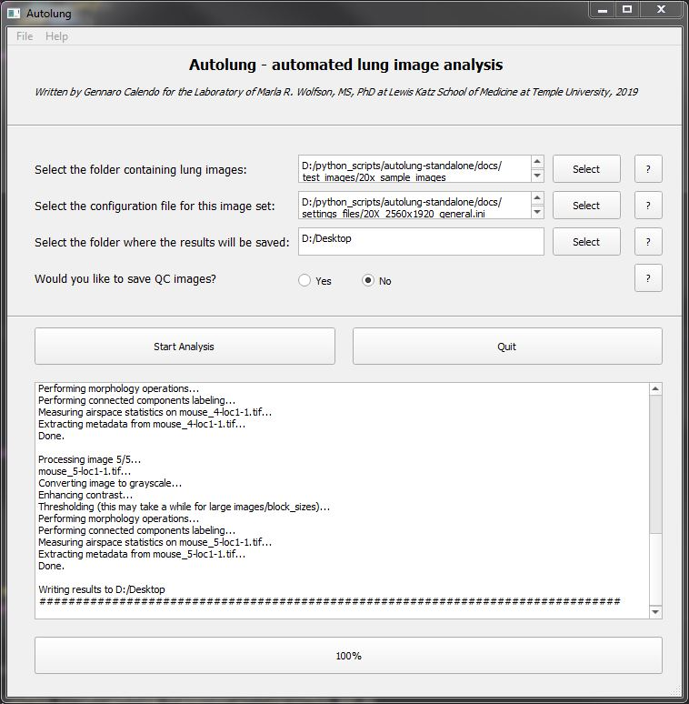

# Autolung

(c) 2019 Gennaro Calendo, Marla R. Wolfson, MS, PhD, Laboratory of Marla R. Wolfson, MS, PhD at the Lewis Katz School of Medicine Temple University, Philadelphia, PA.

PyQt5 version of the autolung app

TODO:
 - Add stdout/stderr output to the MainWindow
 - apply proper backend for matplotlib figures
